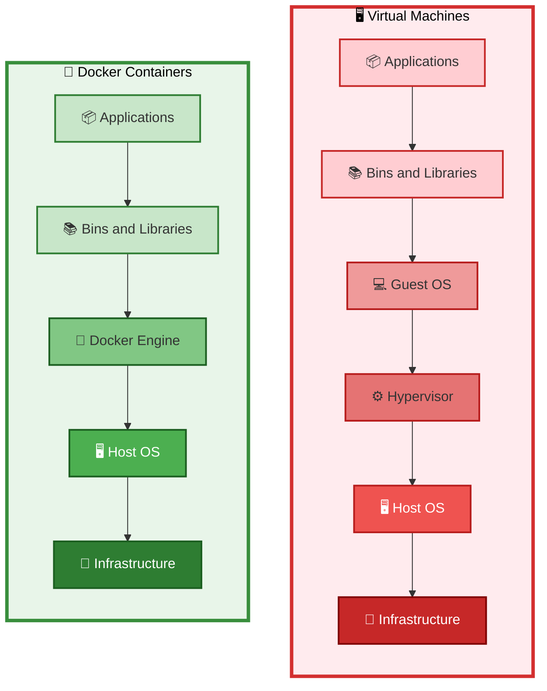
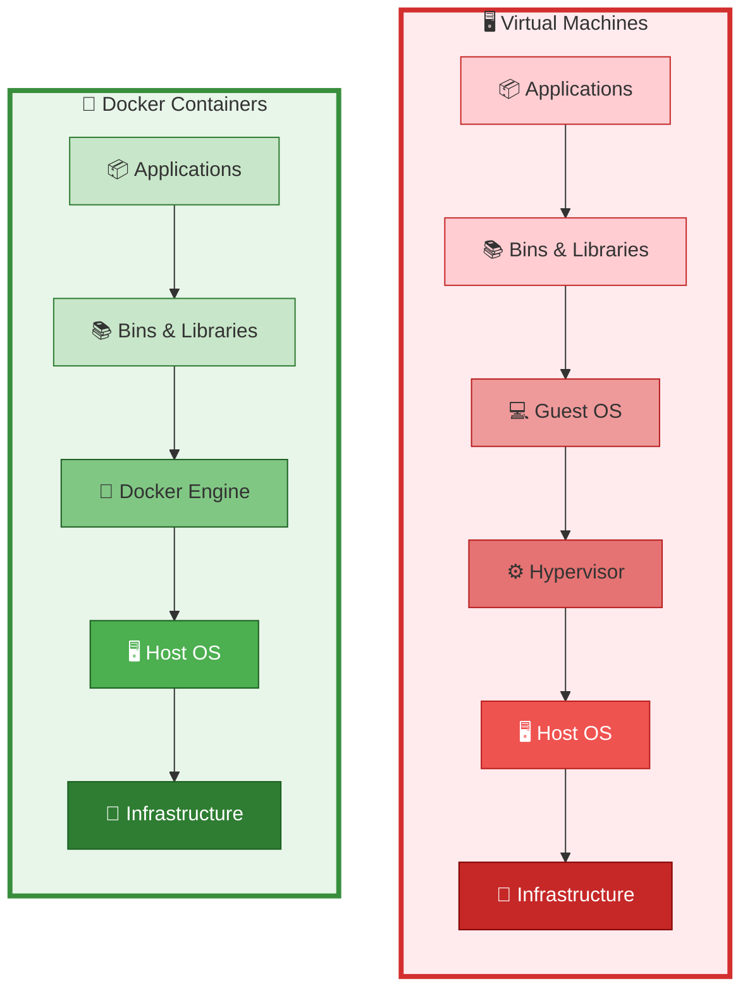
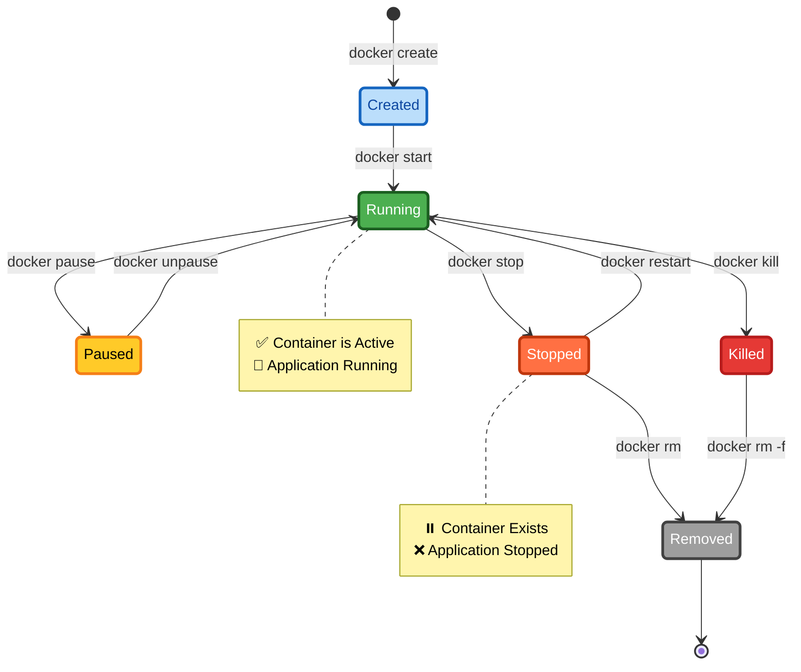
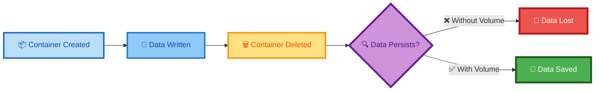
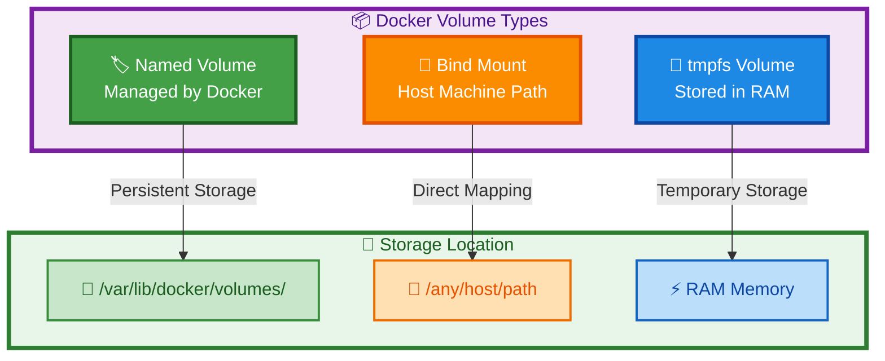
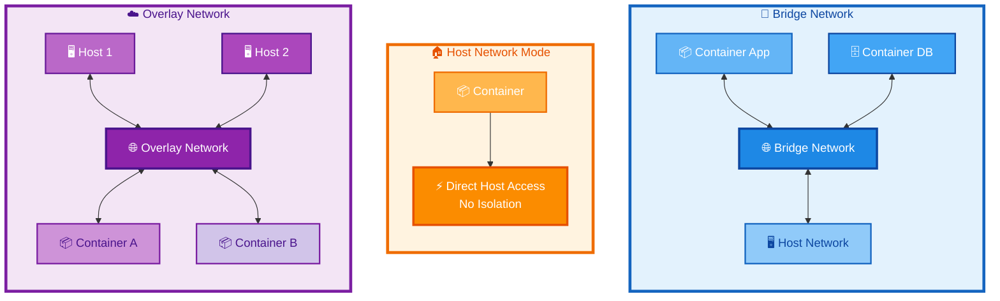
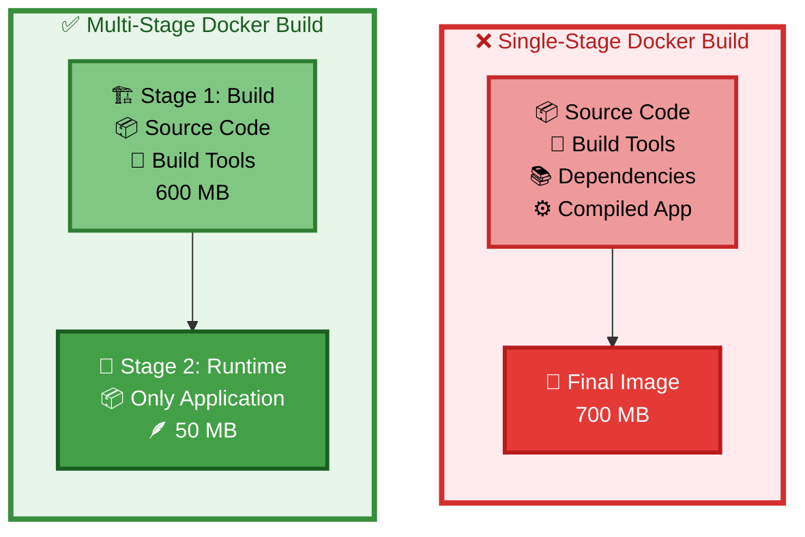

# 🐳 Complete Docker Mastery Guide

<div align="center">


### *From Zero to Production-Ready Docker Expert*

[📚 Documentation](#table-of-contents) • [🚀 Quick Start](#quick-start) • [💼 Projects](#real-world-projects) • [🎯 Best Practices](#best-practices)

</div>

---

## 📖 Table of Contents

<details>
<summary>Click to expand</summary>

- [🎯 Introduction](#introduction)
- [🏗️ Docker Architecture](#docker-architecture)
- [📦 Containers vs VMs](#containers-vs-virtual-machines)
- [🔧 Core Concepts](#core-docker-concepts)
- [📝 Dockerfile Deep Dive](#dockerfile-instructions)
- [💾 Docker Volumes](#docker-volumes-deep-dive)
- [🌐 Docker Networking](#docker-networking)
- [🎨 Multi-Stage Builds](#multi-stage-dockerfile)
- [🚀 Real-World Projects](#real-world-projects)
- [📊 Docker Compose](#docker-compose)
- [🔒 Security Best Practices](#security-best-practices)
- [⚡ Performance Optimization](#performance-optimization)

</details>

---

## 🎯 Introduction

### What is Docker?

Docker is a **containerization platform** that packages applications with all dependencies into standardized units called **containers**.


### Why Docker?

<table>
<tr>
<th>❌ Without Docker</th>
<th>✅ With Docker</th>
</tr>
<tr>
<td>

- ⚠️ "Works on my machine" syndrome
- 🔧 Complex environment setup
- 📦 Dependency conflicts
- ⏱️ Slow deployment cycles
- 💸 Resource wastage

</td>
<td>

- ✅ Consistent environments
- 🚀 Ship anywhere
- 📦 All dependencies packaged
- ⚡ Deploy in seconds
- 💰 Optimal resource usage

</td>
</tr>
</table>

---

## 🏗️ Docker Architecture

### Client-Server Model


### Key Components

| Component | Purpose | Example |
|-----------|---------|---------|
| 🖥️ **Docker Client** | User interface to Docker | `docker run`, `docker build` |
| 🔧 **Docker Daemon** | Background service managing containers | `dockerd` |
| 📦 **Docker Images** | Read-only templates | `nginx:alpine` |
| 🏃 **Containers** | Running instances of images | Your app in production |
| 📚 **Docker Registry** | Image storage/distribution | Docker Hub, ECR |

---

## 📦 Containers vs Virtual Machines

### Architecture Comparison


### Feature Comparison

| Feature | 🖥️ Virtual Machines | 🐳 Docker Containers |
|---------|---------------------|---------------------|
| **OS** | Separate OS per VM | Shared host kernel |
| **Startup** | Minutes ⏰ | Seconds ⚡ |
| **Size** | GBs (Heavy) 🐘 | MBs (Light) 🪶 |
| **Performance** | Medium 📊 | High 🚀 |
| **Isolation** | Complete 🔒 | Process-level 🛡️ |
| **Resource Usage** | High 💰 | Low 💚 |

### Real-World Impact

```bash
# Traditional VM Deployment
Time to deploy: 15-30 minutes
Memory per instance: 2-4 GB
Disk space: 20-50 GB

# Docker Container Deployment
Time to deploy: 5-30 seconds ⚡
Memory per instance: 100-500 MB
Disk space: 100-500 MB
```

---

## 🔧 Core Docker Concepts

### 1. Container Lifecycle



### 2. Essential Commands

<details>
<summary>📋 <b>Container Management</b></summary>

```bash
# Run container
docker run -d --name myapp -p 8080:80 nginx
#  -d: detached mode (background)
#  --name: container name
#  -p: port mapping (host:container)

# List containers
docker ps                  # Running only
docker ps -a              # All containers

# Stop/Start/Restart
docker stop myapp
docker start myapp
docker restart myapp

# Remove container
docker rm myapp           # Stopped container
docker rm -f myapp        # Force remove (running)

# Execute command in container
docker exec -it myapp /bin/bash
#  -i: interactive
#  -t: pseudo-TTY
```

</details>

<details>
<summary>🖼️ <b>Image Management</b></summary>

```bash
# List images
docker images
docker image ls

# Pull image
docker pull nginx:alpine

# Build image
docker build -t myapp:v1 .

# Tag image
docker tag myapp:v1 username/myapp:latest

# Push image
docker push username/myapp:latest

# Remove image
docker rmi myapp:v1
docker image prune        # Remove dangling images
```

</details>

<details>
<summary>🔍 <b>Inspection & Debugging</b></summary>

```bash
# View logs
docker logs myapp
docker logs -f myapp      # Follow logs (real-time)

# Inspect container
docker inspect myapp

# Check resource usage
docker stats              # All containers
docker stats myapp        # Specific container

# View processes
docker top myapp

# Copy files
docker cp myapp:/app/file.txt ./local/
docker cp ./local/file.txt myapp:/app/
```

</details>

---

## 📝 Dockerfile Instructions

### Instruction Overview


### Complete Dockerfile Example

```dockerfile
# ═══════════════════════════════════════════
# Multi-Stage Production Dockerfile
# ═══════════════════════════════════════════

# ─── Stage 1: Build ────────────────────────
FROM node:18-alpine AS builder

# Set metadata
LABEL maintainer="your-email@example.com" \
      version="1.0" \
      description="Production-ready Node.js app"

# Set working directory
WORKDIR /app

# Copy package files first (better caching)
COPY package*.json ./

# Install dependencies
RUN npm ci --only=production && \
    npm cache clean --force

# Copy application code
COPY . .

# Build application
RUN npm run build

# ─── Stage 2: Production ───────────────────
FROM node:18-alpine

# Create non-root user for security
RUN addgroup -g 1001 -S nodejs && \
    adduser -S nodejs -u 1001

WORKDIR /app

# Copy only necessary files from builder
COPY --from=builder --chown=nodejs:nodejs /app/dist ./dist
COPY --from=builder --chown=nodejs:nodejs /app/node_modules ./node_modules
COPY --from=builder --chown=nodejs:nodejs /app/package*.json ./

# Switch to non-root user
USER nodejs

# Expose port
EXPOSE 3000

# Health check
HEALTHCHECK --interval=30s --timeout=3s --start-period=5s --retries=3 \
    CMD node healthcheck.js

# Set environment variables
ENV NODE_ENV=production \
    PORT=3000

# Default command
CMD ["node", "dist/index.js"]
```

### Instruction Deep Dive

<details>
<summary><b>FROM</b> - Base Image Selection 🎯</summary>

```dockerfile
# Standard (Full OS + Tools)
FROM ubuntu:22.04              # ~77 MB

# Slim (Minimal OS)
FROM python:3.11-slim          # ~51 MB

# Alpine (Ultra-minimal)
FROM python:3.11-alpine        # ~21 MB

# Distroless (No shell, max security)
FROM gcr.io/distroless/python3 # ~52 MB

# Scratch (Absolutely empty - Go/Rust only)
FROM scratch                   # 0 MB
```

**Choose based on language:**
- 🐍 Python → `slim` (Alpine has musl libc issues)
- 🟢 Node.js → `alpine` or `slim`
- 🐹 Go → `scratch` or `alpine`
- ☕ Java → `eclipse-temurin:*-jdk-slim`

</details>

<details>
<summary><b>RUN</b> - Execute Commands 🔧</summary>

```dockerfile
# ❌ BAD: Multiple layers
RUN apt-get update
RUN apt-get install -y nginx
RUN apt-get clean

# ✅ GOOD: Single layer with cleanup
RUN apt-get update && \
    apt-get install -y \
        nginx \
        curl \
        vim && \
    apt-get clean && \
    rm -rf /var/lib/apt/lists/*

# Exec form (more predictable)
RUN ["apt-get", "update"]
```

</details>

<details>
<summary><b>COPY vs ADD</b> - File Operations 📁</summary>

```dockerfile
# ✅ COPY: Simple file copying (PREFERRED)
COPY app.py /app/
COPY requirements.txt /app/
COPY src/ /app/src/

# ✅ COPY with ownership
COPY --chown=nodejs:nodejs package*.json ./

# ⚠️ ADD: Has extra features (use sparingly)
ADD archive.tar.gz /app/     # Auto-extracts tar files
ADD https://example.com/file.txt /tmp/  # Downloads from URL

# 🎯 Rule: Use COPY unless you need ADD's special features
```

</details>

<details>
<summary><b>CMD vs ENTRYPOINT</b> - Startup Commands 🚀</summary>

```dockerfile
# CMD: Default command (easily overridden)
CMD ["python", "app.py"]
# Override: docker run myimage python other.py

# ENTRYPOINT: Fixed command (hard to override)
ENTRYPOINT ["python"]
CMD ["app.py"]
# Result: python app.py
# Override args: docker run myimage other.py → python other.py

# Real-world example: Database container
ENTRYPOINT ["docker-entrypoint.sh"]
CMD ["postgres"]
```

**Decision Tree:**
```
Need fixed executable? → ENTRYPOINT
Need default args that users might change? → CMD
Need both? → ENTRYPOINT + CMD
```

</details>

---

## 💾 Docker Volumes Deep Dive

### Why Volumes?


### Volume Types


### Volume Use Cases

<details>
<summary>🗄️ <b>Database Persistence</b></summary>

```bash
# Create named volume
docker volume create mysql_data

# Run MySQL with volume
docker run -d \
  --name mysql \
  -v mysql_data:/var/lib/mysql \
  -e MYSQL_ROOT_PASSWORD=secret \
  -p 3306:3306 \
  mysql:8.0

# Data persists even if container is removed!
docker rm -f mysql
docker run -d --name mysql -v mysql_data:/var/lib/mysql mysql:8.0
# ✅ All data is still there!
```

</details>

<details>
<summary>📂 <b>Bind Mount for Development</b></summary>

```bash
# Live code reloading during development
docker run -d \
  --name dev-app \
  -v $(pwd)/src:/app/src \
  -p 3000:3000 \
  node:18-alpine \
  npm run dev

# Changes in ./src reflect immediately in container!
```

</details>

<details>
<summary>🔒 <b>EBS Volume for Production (AWS)</b></summary>

```bash
# 1. Create EBS volume in same AZ as EC2
# 2. Attach to EC2 instance as /dev/xvdb
# 3. Format and mount

# Format (first time only)
sudo mkfs.ext4 /dev/xvdb

# Create mount point
sudo mkdir -p /mnt/ebs-data

# Set permissions
sudo chown -R ec2-user:ec2-user /mnt/ebs-data

# Add to /etc/fstab for persistence
UUID=$(sudo blkid /dev/xvdb -s UUID -o value)
echo "UUID=$UUID /mnt/ebs-data ext4 defaults,nofail 0 2" | \
  sudo tee -a /etc/fstab

# Mount
sudo mount -a

# Run container with EBS volume
docker run -d \
  --name production-db \
  -v /mnt/ebs-data:/var/lib/mysql \
  mysql:8.0
```

</details>

### Volume Management Commands

```bash
# Create volume
docker volume create my-data

# List volumes
docker volume ls

# Inspect volume
docker volume inspect my-data

# Remove volume
docker volume rm my-data

# Remove all unused volumes
docker volume prune

# Check which container uses volume
docker ps -a --filter volume=my-data
```

---

## 🌐 Docker Networking

### Network Types



### Network Comparison

| Network Type | Use Case | Isolation | Performance |
|--------------|----------|-----------|-------------|
| 🌉 **Bridge** | Single host, microservices | ✅ Yes | Fast |
| 🏠 **Host** | Need host network stack | ❌ No | Fastest |
| 🚫 **None** | Complete isolation | ✅ Maximum | N/A |
| ☁️ **Overlay** | Multi-host (Swarm/K8s) | ✅ Yes | Good |
| 📡 **Macvlan** | Legacy apps needing MAC | ⚠️ Limited | Fast |

### Networking Examples

<details>
<summary>🌉 <b>Bridge Network (Microservices)</b></summary>

```bash
# Create custom bridge network
docker network create my-app-network

# Run backend
docker run -d \
  --name backend \
  --network my-app-network \
  -e DB_HOST=database \
  my-backend:latest

# Run database
docker run -d \
  --name database \
  --network my-app-network \
  -v db-data:/var/lib/mysql \
  mysql:8.0

# Run frontend
docker run -d \
  --name frontend \
  --network my-app-network \
  -p 80:80 \
  -e BACKEND_URL=http://backend:3000 \
  my-frontend:latest

# ✅ Containers communicate using names!
# backend connects to: mysql://database:3306
# frontend connects to: http://backend:3000
```

</details>

<details>
<summary>🏠 <b>Host Network (Performance Critical)</b></summary>

```bash
# Use host network (no port mapping needed)
docker run -d \
  --name nginx \
  --network host \
  nginx:alpine

# ✅ nginx binds directly to host's port 80
# ⚠️ No isolation - port conflicts possible
```

</details>

<details>
<summary>☁️ <b>Overlay Network (Docker Swarm)</b></summary>

```bash
# Initialize swarm
docker swarm init

# Create overlay network
docker network create -d overlay my-overlay

# Deploy service across hosts
docker service create \
  --name web \
  --network my-overlay \
  --replicas 3 \
  nginx:alpine

# ✅ Containers on different hosts communicate seamlessly
```

</details>

---

## 🎨 Multi-Stage Dockerfile

### Why Multi-Stage?



### Real-World Example: Go Application

```dockerfile
# ═══════════════════════════════════════════
# Multi-Stage Dockerfile for Go Application
# ═══════════════════════════════════════════

# ─── Stage 1: Build ────────────────────────
FROM golang:1.21 AS builder

WORKDIR /app

# Copy go mod files first (better caching)
COPY go.mod go.sum ./
RUN go mod download

# Copy source code
COPY . .

# Build static binary
RUN CGO_ENABLED=0 GOOS=linux go build -a -installsuffix cgo -o main .

# ─── Stage 2: Production ───────────────────
FROM alpine:3.19

# Install ca-certificates for HTTPS
RUN apk --no-cache add ca-certificates

WORKDIR /root/

# Copy ONLY the binary from builder
COPY --from=builder /app/main .

EXPOSE 8080

CMD ["./main"]
```

**Result:**
- Builder stage: **~900 MB** (never shipped)
- Final image: **~15 MB** ✅
- **98% size reduction!**

### Java Spring Boot Example

```dockerfile
# ═══════════════════════════════════════════
# Multi-Stage for Java Spring Boot
# ═══════════════════════════════════════════

# ─── Stage 1: Build with Maven ────────────
FROM maven:3.9.3-eclipse-temurin-17 AS builder

WORKDIR /app

# Download dependencies first (cached layer)
COPY pom.xml .
RUN mvn dependency:go-offline -B

# Copy source and build
COPY src ./src
RUN mvn clean package -DskipTests

# ─── Stage 2: Runtime ──────────────────────
FROM eclipse-temurin:17-jre-alpine

WORKDIR /app

# Copy only the JAR
COPY --from=builder /app/target/*.jar app.jar

# Non-root user
RUN addgroup -g 1001 spring && \
    adduser -S spring -u 1001
USER spring:spring

EXPOSE 8080

ENTRYPOINT ["java", "-jar", "app.jar"]
```

**Result:**
- Builder: **~800 MB**
- Runtime: **~250 MB** ✅
- **70% smaller!**

---

## 🚀 Real-World Projects

### Project 1: Full-Stack App with Docker Compose

```yaml
# docker-compose.yml
version: '3.8'

services:
  # Frontend
  frontend:
    build:
      context: ./frontend
      dockerfile: Dockerfile
    ports:
      - "80:80"
    environment:
      - REACT_APP_API_URL=http://localhost:3000
    depends_on:
      - backend
    networks:
      - app-network

  # Backend API
  backend:
    build:
      context: ./backend
      dockerfile: Dockerfile
    ports:
      - "3000:3000"
    environment:
      - DB_HOST=database
      - DB_PORT=5432
      - DB_NAME=myapp
      - DB_USER=postgres
      - DB_PASSWORD=secret
    depends_on:
      database:
        condition: service_healthy
    networks:
      - app-network
    volumes:
      - ./backend/uploads:/app/uploads

  # PostgreSQL Database
  database:
    image: postgres:15-alpine
    environment:
      - POSTGRES_DB=myapp
      - POSTGRES_USER=postgres
      - POSTGRES_PASSWORD=secret
    volumes:
      - postgres-data:/var/lib/postgresql/data
    networks:
      - app-network
    healthcheck:
      test: ["CMD-SHELL", "pg_isready -U postgres"]
      interval: 10s
      timeout: 5s
      retries: 5

  # Redis Cache
  redis:
    image: redis:7-alpine
    command: redis-server --appendonly yes
    volumes:
      - redis-data:/data
    networks:
      - app-network

volumes:
  postgres-data:
  redis-data:

networks:
  app-network:
    driver: bridge
```

**Run the stack:**
```bash
# Start all services
docker-compose up -d

# View logs
docker-compose logs -f

# Stop all services
docker-compose down

# Stop and remove volumes
docker-compose down -v
```

---

## 📊 Docker Compose

### Compose File Structure

```yaml
version: '3.8'

services:
  # Service definitions
  
volumes:
  # Named volumes
  
networks:
  # Custom networks
  
configs:
  # Configuration files
  
secrets:
  # Sensitive data
```

### Common Patterns

<details>
<summary>🔄 <b>Health Checks</b></summary>

```yaml
services:
  api:
    image: my-api:latest
    healthcheck:
      test: ["CMD", "curl", "-f", "http://localhost:3000/health"]
      interval: 30s
      timeout: 10s
      retries: 3
      start_period: 40s
```

</details>

<details>
<summary>🔗 <b>Service Dependencies</b></summary>

```yaml
services:
  web:
    depends_on:
      db:
        condition: service_healthy
      redis:
        condition: service_started
```

</details>

<details>
<summary>🌍 <b>Environment Variables</b></summary>

```yaml
services:
  app:
    environment:
      - NODE_ENV=production
      - PORT=3000
    env_file:
      - .env
      - .env.production
```

</details>

---

## 🔒 Security Best Practices

### 1. Use Non-Root User

```dockerfile
# ❌ BAD: Running as root
FROM node:18
WORKDIR /app
COPY . .
CMD ["node", "index.js"]

# ✅ GOOD: Non-root user
FROM node:18
RUN addgroup -g 1001 -S nodejs && \
    adduser -S nodejs -u 1001
WORKDIR /app
COPY --chown=nodejs:nodejs . .
USER nodejs
CMD ["node", "index.js"]
```

### 2. Scan for Vulnerabilities

```bash
# Scan image with Trivy
trivy image myapp:latest

# Scan with Docker Scout
docker scout cves myapp:latest

# Scan with Snyk
snyk container test myapp:latest
```

### 3. Use .dockerignore

```bash
# .dockerignore
node_modules
npm-debug.log
.git
.env
.DS_Store
*.md
dist
coverage
.dockerignore
Dockerfile
docker-compose.yml
```

### 4. Secrets Management

```yaml
# ❌ BAD: Secrets in environment variables
environment:
  - DB_PASSWORD=mysecretpassword

# ✅ GOOD: Docker secrets
secrets:
  - db_password

services:
  app:
    secrets:
      - db_password
```

---

## ⚡ Performance Optimization

### 1. Layer Caching

```dockerfile
# ❌ BAD: Changes to source code invalidate dependency install
COPY . .
RUN npm install

# ✅ GOOD: Copy package.json first
COPY package*.json ./
RUN npm install
COPY . .
```

### 2. Multi-Stage Builds

```dockerfile
# ❌ Single stage: 1.2 GB
FROM node:18
WORKDIR /app
COPY . .
RUN npm install
RUN npm run build
CMD ["npm", "start"]

# ✅ Multi-stage: 150 MB
FROM node:18 AS builder
WORKDIR /app
COPY package*.json ./
RUN npm install
COPY . .
RUN npm run build

FROM node:18-alpine
WORKDIR /app
COPY --from=builder /app/dist ./dist
COPY --from=builder /app/node_modules ./node_modules
CMD ["node", "dist/index.js"]
```

### 3. Use Alpine Images

```dockerfile
# Standard: 900 MB
FROM node:18

# Slim: 240 MB
FROM node:18-slim

# Alpine: 175 MB ✅
FROM node:18-alpine
```

---

## 🎓 Quick Reference

### Most Used Commands

```bash
# Container Operations
docker run -d --name app -p 8080:80 nginx
docker ps
docker stop app
docker rm app
docker logs -f app

# Image Operations
docker build -t myapp:v1 .
docker images
docker push myapp:v1
docker pull nginx:alpine

# System Cleanup
docker system prune -a
docker volume prune
docker network prune

# Compose Operations
docker-compose up -d
docker-compose down
docker-compose logs -f
docker-compose ps
```

### Troubleshooting

```bash
# Debug container
docker exec -it container_name sh
docker logs container_name
docker inspect container_name

# Check resources
docker stats
docker system df

# Network issues
docker network ls
docker network inspect bridge
```

---

## 📚 Additional Resources

<div align="center">

### 🔗 Official Documentation

[](https://docs.docker.com/)
[](https://hub.docker.com/)

### 📖 Learning Resources

- [Docker Official Tutorial](https://www.docker.com/get-started)
- [Play with Docker](https://labs.play-with-docker.com/)
- [Docker Curriculum](https://docker-curriculum.com/)

</div>

---

## 🤝 Contributing

Contributions are welcome! Feel free to:
- 🐛 Report bugs
- 💡 Suggest features
- 📝 Improve documentation
- 🔧 Submit pull requests

---

## 📄 License

This project is licensed under the MIT License.

---

<div align="center">

### Made with ❤️ by DevOps Engineers

⭐ Star this repo if you found it helpful!

[⬆ Back to Top](#-complete-docker-mastery-guide)

</div>
